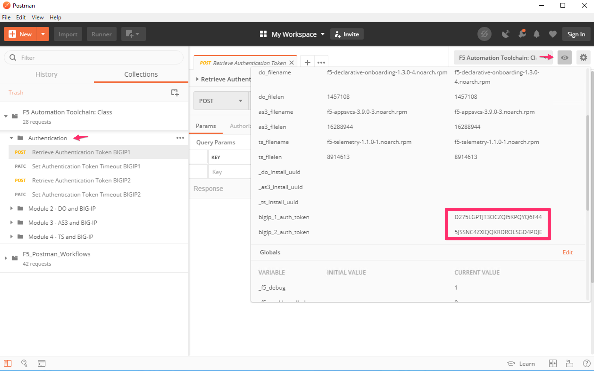

Lab Information: Priming the Environment
========================================

|image1| **Environmental Configuration**

Lab Setup:
----------

Our lab environment utilizes a jump host with Postman for the Modules. In the steps below we set up the environment ready and able for the lab.

Task |labmodule|\.\ |labnum|\.1
-------------------------------

.. NOTE:: You should have received all your student info to access the lab if you have not, please find an instructor.

Begin by connecting to your lab environment portal. From the portal, you have a view of the components within the lab.

From the portal find your `Win 7 Jumphost`, open using the RDP Access method.

.. Warning:: You need to have Microsoft RDP protocol and application allowed to be executed to access external resources. RDP can be blocked with always-on VPN services or firewalls.

Credentials for the `Win 7 Jumphost`:

- Username:``student``
- Password:``automation``

Task |labmodule|\.\ |labnum|\.2
-------------------------------

Familiarize yourself with the Remote Desktop, in this module we are going to be using a few tools provided in the jump host. 

  |image2|

The following tools are used in this lab:

- vscode_ as our code editor / validator
- Postman_ as our API interaction tool
- Chrome_ as our browser

Task |labmodule|\.\ |labnum|\.3
-------------------------------

Open up Postman and import the collection needed for this Lab. This collection configuration is used for this module and modules to follow.
  
  |image3|

Choose `Import from Link`:

  |image4|

Copy the collection path and import into Postman:

``https://raw.githubusercontent.com/jmcalalang/f5-automation-toolchain-lab/master/files/postman_collections/F5%20Automation%20Toolchain-%20Class.postman_collection.json``

Task |labmodule|\.\ |labnum|\.4
-------------------------------

Open up Postman and import the environment needed for this Lab. This environment configuration is used for this module and modules to follow.
  
  |image3|

Choose `Import from Link`:

  |image4|

Copy the environment path and import into Postman:

``https://raw.githubusercontent.com/jmcalalang/f5-automation-toolchain-lab/master/files/postman_collections/F5%20Automation%20Toolchain-%20Class.postman_environment.json``

Task |labmodule|\.\ |labnum|\.5
-------------------------------

**Verify and set** both the collection and the environment are imported into Postman.

Collection:
  |image5|

Environment:
  |image6|

Task |labmodule|\.\ |labnum|\.6
-------------------------------

We are going to set some authentication tokens for use throughout this lab. 

.. Note:: F5 BIG-IP authentication token last a maximum of 10 hours

Expand the `Authentication` tab within the collection and run (**SEND**) for **all** of the steps in order. This section, requests, extends, and stores our tokens in Postman environment variables to be used.

  |image7|

The environment is now ready to be used.

.. |labmodule| replace:: labinfo
.. |labnum| replace:: 2
.. |labdot| replace:: |labmodule|\ .\ |labnum|
.. |labund| replace:: |labmodule|\ _\ |labnum|
.. |labname| replace:: Lab\ |labdot|
.. |labnameund| replace:: Lab\ |labund|

.. |image1| image:: images/image1.png
   :width: 200px
.. |image2| image:: images/image2.png
   :width: 100%
.. |image3| image:: images/image3.png
   :width: 50%
.. |image4| image:: images/image4.png
   :width: 25%
.. |image5| image:: images/image5.png
   :width: 25%
.. |image6| image:: images/image6.png
   :width: 25%

   
.. _vscode: https://code.visualstudio.com/
.. _Postman: https://www.getpostman.com
.. _Chrome: https://www.google.com/chrome/
