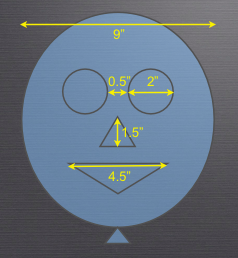

Module |labmodule|\, Lab \ |labnum|\: 99 Test Balloons Part 2
=============================================================

Exercise Part 2:
~~~~~~~~~~~~~~~~

How can we improve our product? How can we improve our process?

- Defining acceptance criteria is not the same as writing tests, only to be applied after something is produced. They can be used as requirements, as tests, and as a target for developers.

- Automating acceptance tests (or executable requirements) can be very useful, as demonstrated by the test harnesses produced during the game.

- The investment in creating and automating acceptance tests is worthwhile and has a high return.

Task |labmodule|\.\ |labnum|\.1
~~~~~~~~~~~~~~~~~~~~~~~~~~~~~~~

Each team is allowed **3 Minutes** to produce as many balloons that meet acceptance criteria as possible. No further instruction is needed.

- Ingredients
    - Left over balloons
    - 3 Miniutes
    - Small amounts of aggitation
    - Teamwork
    - Balloon face acceptance framework

Balloon face acceptance framework:

  |image1|

.. |labmodule| replace:: 1
.. |labnum| replace:: 2
.. |labdot| replace:: |labmodule|\ .\ |labnum|
.. |labund| replace:: |labmodule|\ _\ |labnum|
.. |labname| replace:: Lab\ |labdot|
.. |labnameund| replace:: Lab\ |labund|

.. _CloudDocs: https://clouddocs.f5.com