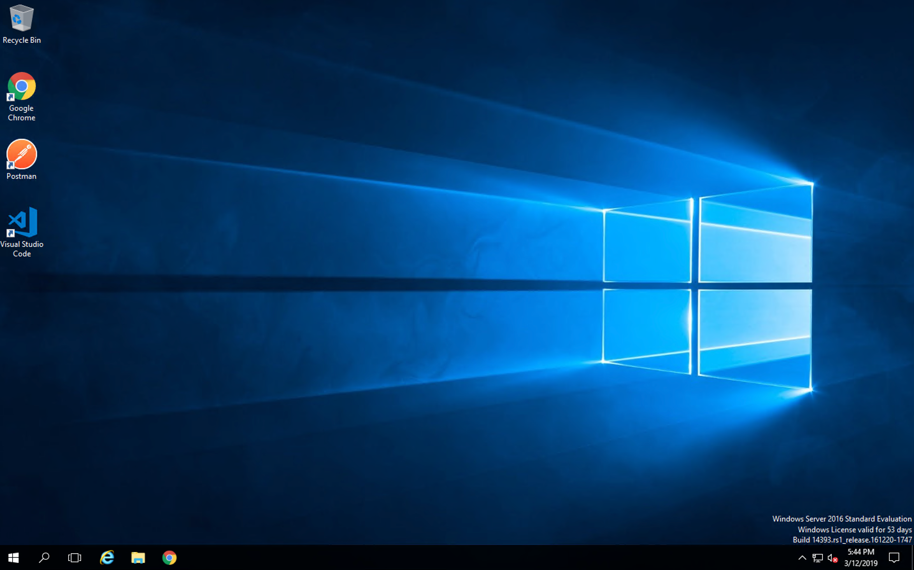

Module |labmodule|\, Lab \ |labnum|\: F5 Declarative Onboarding
===============================================================

|image1| **Declarative Onboarding**

Lab scenario:
~~~~~~~~~~~~~

F5 Declarative Onboarding (DO) uses a declarative_ model to initially configure a BIG-IP device with all of the required settings to get up and running. This includes system settings such as licensing and provisioning, network settings such as VLANs and Self IPs, and clustering settings if you are using more than one BIG-IP system. If you want to use a declarative model to configure applications and services on a BIG-IP device that already has these initial settings, see the Application Services 3 (AS3_) documentation.

A declarative model means you provide a JSON declaration rather than a set of imperative commands. The declaration represents the configuration which Declarative Onboarding is responsible for creating on a BIG-IP system. You send a declaration file using a single Rest API call.

.. Topic:: Lab Directive

    This lab we will use a Declarative Onboarding declaration to build out our BIG-IP units.

Task |labmodule|\.\ |labnum|\.1
~~~~~~~~~~~~~~~~~~~~~~~~~~~~~~~

.. NOTE:: You should have received all your student info to access the lab, if you have not please find an instructor.

Begin by connecting to your lab environment portal. From the portal you have a view of the components within the lab.

From the portal find your `Windows 2016 Server`, download and open using the RDP Access method.

.. Warning:: You will need to have the Microsoft RDP protocol and application allowed to be executed to access external resources.

Credentials for the `Windows 2016 Server`:

- Username:`Administator`
- Password:`F5d3mo`

Task |labmodule|\.\ |labnum|\.2
~~~~~~~~~~~~~~~~~~~~~~~~~~~~~~~

.. Note:: Go ahead and close Server Manager it is not needed

Familarize yourself with the Remote Desktop, in this module we are going to be using a few tools provided in the jump host. 

  |image2|

The following tools are used in this lab:

- vscode_ as our code editor / validator
- Postman_ as our API interaction tool
- Chrome_ as our browser

Task |labmodule|\.\ |labnum|\.3
~~~~~~~~~~~~~~~~~~~~~~~~~~~~~~~

Open up Postman and import the collection needed for this Lab. This collection will be used for this module and modules to follow.
  
  |image3|

Choose `Import from Link`:

  |image4|

Copy the collection path and import into Postman:

``https://raw.githubusercontent.com/jmcalalang/f5-automation-toolchain-lab/master/files/postman_collections/F5%20Automation%20Toolchain-%20Class.postman_collection.json``

Task |labmodule|\.\ |labnum|\.4
~~~~~~~~~~~~~~~~~~~~~~~~~~~~~~~

Open up Postman and import the environment needed for this Lab. This environment will be used for this module and modules to follow.
  
  |image3|

Choose `Import from Link`:

  |image4|

Copy the collection path and import into Postman:

``https://raw.githubusercontent.com/jmcalalang/f5-automation-toolchain-lab/master/files/postman_collections/F5%20Automation%20Toolchain-%20Class.postman_environment.json``

Task |labmodule|\.\ |labnum|\.4
~~~~~~~~~~~~~~~~~~~~~~~~~~~~~~~

**Verify and set** both the collection and the environment have been imported into Postman.

Collection:
  |image5|

Environment:
  |image6|

.. literalinclude :: files/do_cluster_bigip1.json
   :language: json

.. |labmodule| replace:: 2
.. |labnum| replace:: 1
.. |labdot| replace:: |labmodule|\ .\ |labnum|
.. |labund| replace:: |labmodule|\ _\ |labnum|
.. |labname| replace:: Lab\ |labdot|
.. |labnameund| replace:: Lab\ |labund|
.. |image1| image:: images/image1.png
   :width: 50px

.. |image3| image:: images/image3.png
.. |image4| image:: images/image4.png
.. |image5| image:: images/image5.png
.. |image6| image:: images/image6.png
 
.. _declarative: https://www.f5.com/company/blog/in-container-land-declarative-configuration-is-king
.. _as3: https://clouddocs.f5.com/products/extensions/f5-appsvcs-extension/3/
.. _vscode: https://code.visualstudio.com/
.. _Postman: https://www.getpostman.com
.. _Chrome: https://www.google.com/chrome/