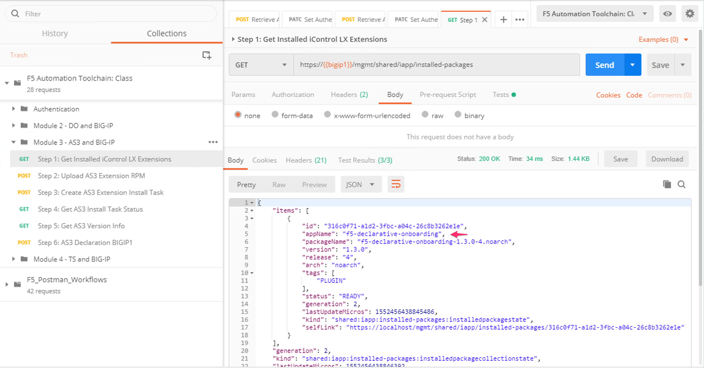
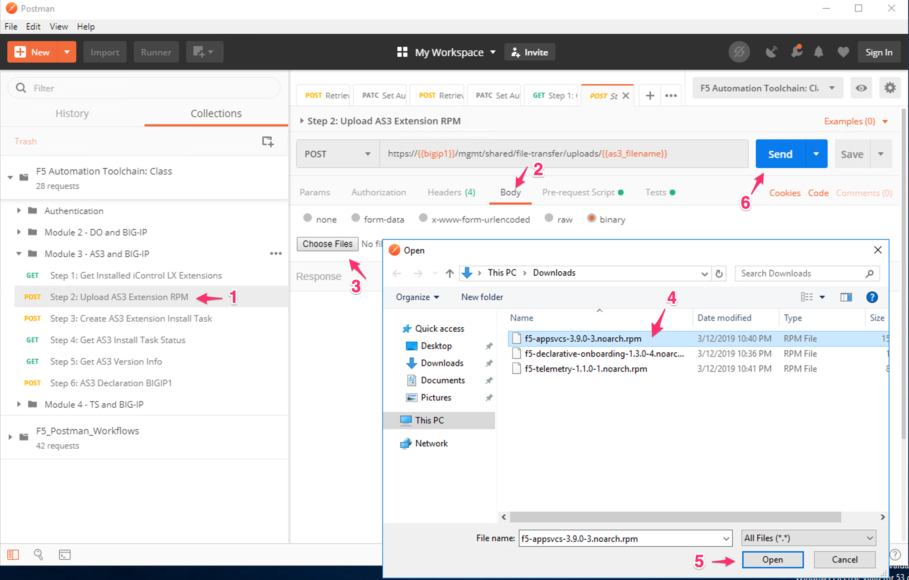
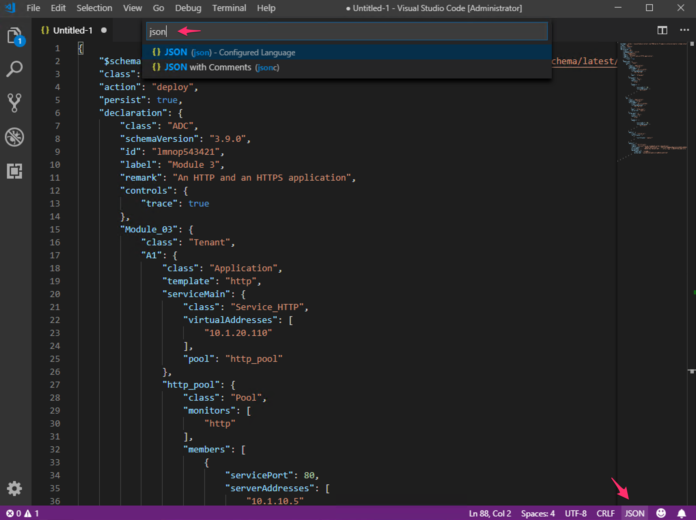
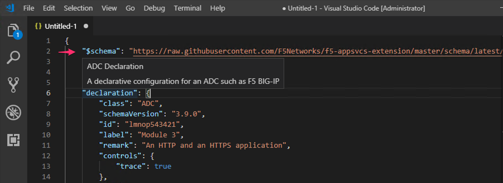
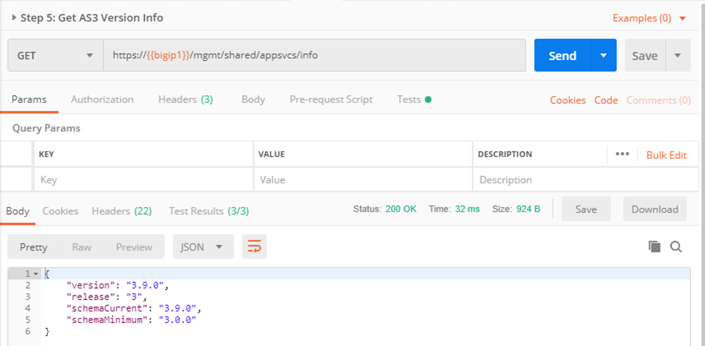
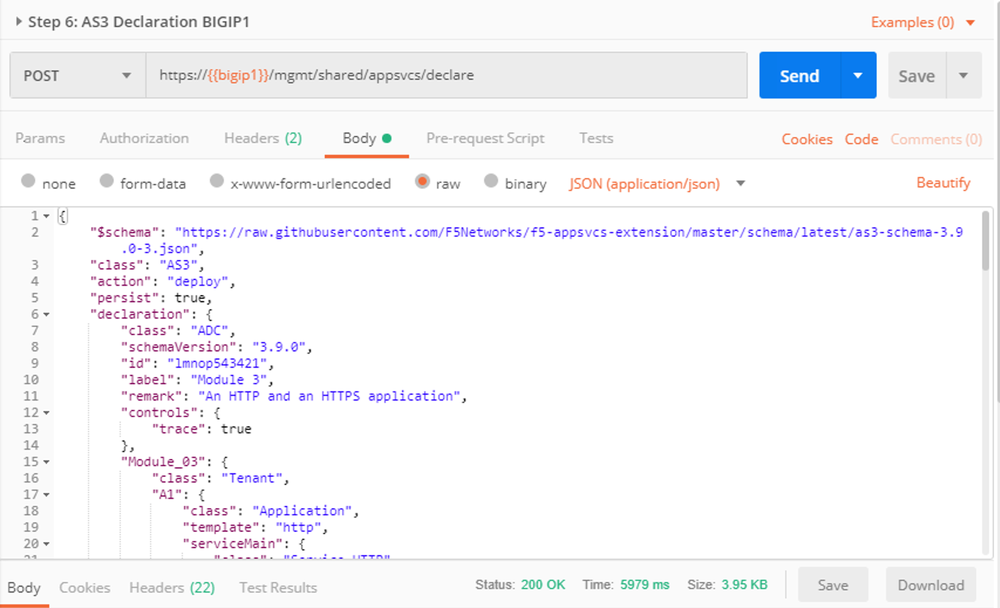
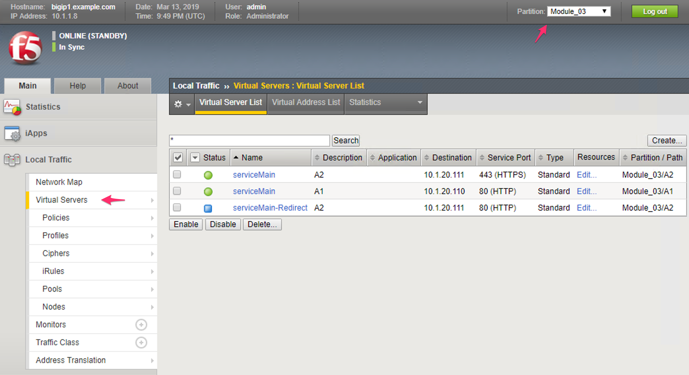

Module |labmodule|\, Lab \ |labnum|\: F5 Application Services 3
===============================================================

|image1| **Application Services 3**

Lab scenario:
~~~~~~~~~~~~~

Application Services 3 Extension (referred to as AS3 Extension or more often simply AS3) is a flexible, low-overhead mechanism for managing application-specific configurations on a BIG-IP system. AS3 uses a declarative model, meaning you provide a JSON declaration rather than a set of imperative commands. The declaration represents the configuration which AS3 is responsible for creating on a BIG-IP system. AS3 is well-defined according to the rules of JSON Schema, and declarations validate according to JSON Schema. AS3 accepts declaration updates via REST (push), reference (pull), or CLI (flat file editing).

.. Topic:: Lab Directive

    This lab uses an AS3 declaration to build out our BIG-IP Application Configuration.

.. seealso:: AS3 CloudDocs_ Page

Task |labmodule|\.\ |labnum|\.1
~~~~~~~~~~~~~~~~~~~~~~~~~~~~~~~

BIGIP1 and BIGIP2 are in a cluster which shares configuration objects. As configuration objects are in sync, we only need to install that AS3 package and send the declaration to a single BIG-IP. 

Task |labmodule|\.\ |labnum|\.1
~~~~~~~~~~~~~~~~~~~~~~~~~~~~~~~

Expand the `Module 3 - AS3 and BIG-IP` tab within the collection and execute `Step 1: Get Installed iControl LX Extensions BIGIP1`. This step requests the icontrollx packages already installed on the BIG-IP.

.. note:: Module2 we installed the DO package, and we can see that installed now

 
  |image2|

Task |labmodule|\.\ |labnum|\.3
~~~~~~~~~~~~~~~~~~~~~~~~~~~~~~~

Installation of the AS3 package is the same process we experienced installing DO. We upload the file, install the package, then send a declaration for AS3 to consume.

Open step `Step 2: Upload AS3 Extension RPM`, select the AS3 rpm file and then execute.

  |image3|

Task |labmodule|\.\ |labnum|\.4
~~~~~~~~~~~~~~~~~~~~~~~~~~~~~~~

Once the rpm package is installed on the BIGIP1, we need to tell the BIG-IP to install the package so we can make use of it.

Execute the following steps viewing the response pages and the status of installing the DO package.

Step 3: Create AS3 Extension Install Task:

  |image4|

Step 4: Get AS3 Install Task Status:

  |image5|

Step 5: Step 5: Get AS3 Version Info:

  |image8|

.. Note:: AS3 has a ready status URI of ``/info``, this informs you of the version installed and schema that is accepted.

Task |labmodule|\.\ |labnum|\.5
~~~~~~~~~~~~~~~~~~~~~~~~~~~~~~~

With the AS3 package installed into our cluster, we are ready to submit our first application service declaration. 

The desired end state of these DO configurations is to configure the below objects, built on the BIG-IPs with a single call in a single file. This declarative solution allows me to compose configurations that are reusable with templating technologies and storable in Source Control.

.. seealso:: This AS3 declaration was created from an F5 provided example located on CloudDocs_AS3_Example_

Configuration Items in our declaration:
  - Configuration Partition
  - Virtual Server x2
  - Pool x 2
  - Pool Member
  - Certificate
  - Keys

Declaration for BIGIP1:

.. literalinclude :: files/as3_ssl_redirect.json
   :language: json

Copy **all of** the AS3 declaration.

Task |labmodule|\.\ |labnum|\.6
~~~~~~~~~~~~~~~~~~~~~~~~~~~~~~~

F5 publishes a schema for each of the Automation Toolchain items. This published schema can be used in Visual Studio Code allowing you to see context and find errors within your different declarations. The schema reference is added at the top of your declaration, and requires vscode to know the language is JSON.

.. seealso:: Schema Validation for AS3 (AS3_Schema_)

Open `Visual Studio Code` on your jump host desktop and open a `New File` (shortcut Ctrl+n) and paste in all of the AS3 declaration contents, then set the language to `json`.

  |image6|

Once the declaration and language are defined, you can highlight over sections of the code to see context and errors.

.. note:: You can try misspelling some of the declaration objects to see errors, remember to revert your changes.

  |image7|

Task |labmodule|\.\ |labnum|\.7
~~~~~~~~~~~~~~~~~~~~~~~~~~~~~~~

We now need to send our declaration to BIGIP1.

.. Note:: Because we are sending our AS3 declaration into a BIG-IP cluster, we only need to send this to one unit.

Click on step `Step 6: AS3 Declaration BIGIP1`, navigate to the `Body` tab and paste in all of your declaration, and send the call. 

.. note:: You can leave the schema validation line, the BIG-IP ignores it.

  |image9|

The declaration is now on BIGIP1 being processed; this takes a few seconds to process and build out our objects. 

Task |labmodule|\.\ |labnum|\.8
~~~~~~~~~~~~~~~~~~~~~~~~~~~~~~~

Return to your BIGIP1 gui in Chrome; you can now navigate around the UI and see the objects in our declaration created.

  
  |image10|

.. seealso:: AS3 creates a partition for it to control based off what's defined in the declaration. There are many benefits to this design, small blast radius, environment-specific configuration, and organization. More information about this can be found in the AS3 FAQ_

.. |labmodule| replace:: 3
.. |labnum| replace:: 1
.. |labdot| replace:: |labmodule|\ .\ |labnum|
.. |labund| replace:: |labmodule|\ _\ |labnum|
.. |labname| replace:: Lab\ |labdot|
.. |labnameund| replace:: Lab\ |labund|
.. |image1| image:: images/image1.png
   :width: 50px

.. |image4| image:: images/image4.png
   :width: 50px
.. |image5| image:: images/image5.png
   :width: 50px

.. _CloudDocs: https://clouddocs.f5.com/products/extensions/f5-appsvcs-extension/latest/
.. _CloudDocs_AS3_Example: https://clouddocs.f5.com/products/extensions/f5-appsvcs-extension/latest/declarations/http-services.html#http-and-https-virtual-services-in-one-declaration
.. _AS3_Schema: https://clouddocs.f5.com/products/extensions/f5-appsvcs-extension/latest/userguide/validate.html
.. _FAQ: https://clouddocs.f5.com/products/extensions/f5-appsvcs-extension/latest/userguide/faq.html?highlight=partitions