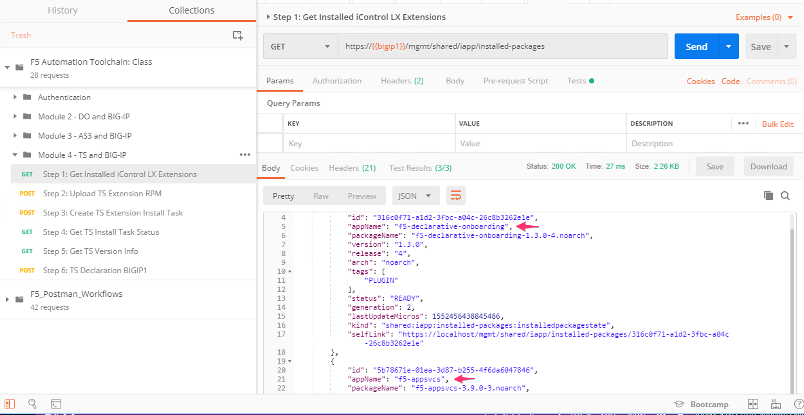
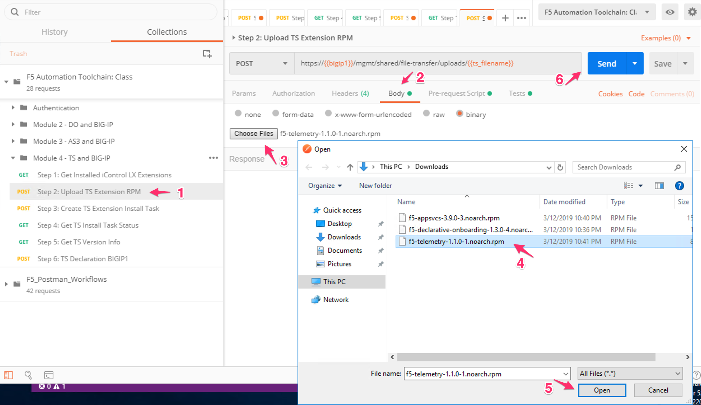
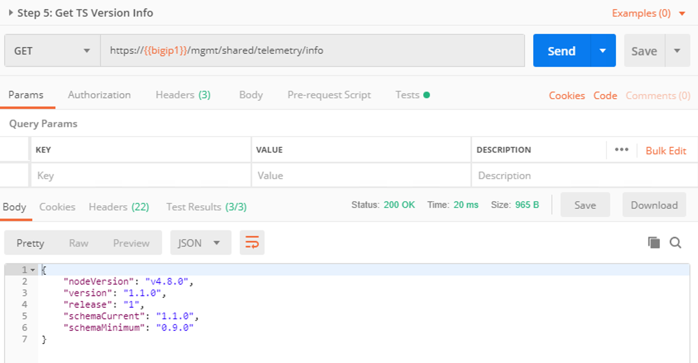
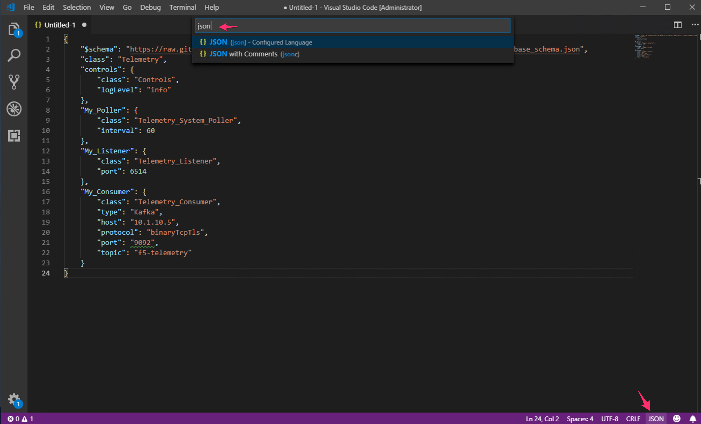
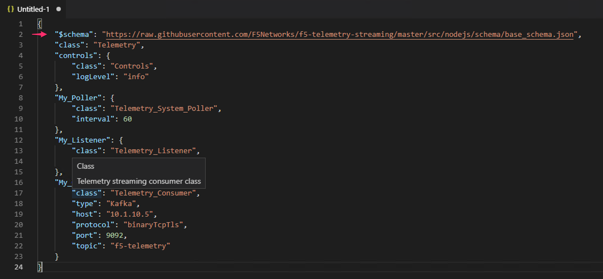
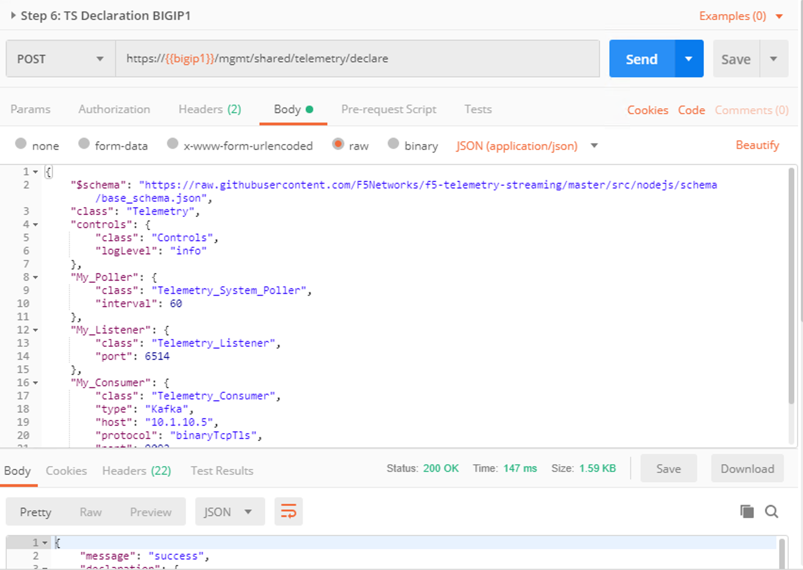

Module |labmodule|\, Lab \ |labnum|\: F5 Telemetry Streaming
============================================================

|image1| **Telemetry Streaming**

Introduction:
~~~~~~~~~~~~~

  |image7|

Telemetry Streaming (TS) is an iControl LX Extension delivered as a TMOS-independent RPM file. Installing the TS Extension on BIG-IP enables you to declaratively aggregate, normalize, and forward statistics and events from the BIG-IP to a consumer application by POSTing a single TS JSON declaration to the TS declarative REST API endpoint. The supported third-party consumers include:

  - Splunk
  - Azure Log Analytics
  - AWS CloudWatch
  - AWS S3
  - Graphite
  - Kafka
  - ElasticSearch
  - Sumo Logic
  - StatsD

.. Topic:: Lab Directive

    This lab uses a TS declaration to build out our BIG-IP system forwarder.

.. seealso:: TS CloudDocs_ Page

Task |labmodule|\.\ |labnum|\.1
~~~~~~~~~~~~~~~~~~~~~~~~~~~~~~~

BIGIP1 and BIGIP2 are in a cluster which shares configuration objects. As configuration objects are in sync, we only need to install the TS package and send a declaration to a single BIG-IP. 

Task |labmodule|\.\ |labnum|\.2
~~~~~~~~~~~~~~~~~~~~~~~~~~~~~~~

Expand the `Module 4 - TS and BIG-IP` tab within the collection and execute `Step 1: Get Installed iControl LX Extensions`. This step requests the iControl LX packages already installed on the BIG-IP.
 
  |image2|

.. note:: Module2 we installed the DO package, Module3 we installed AS3, we see both of them installed now.

Task |labmodule|\.\ |labnum|\.3
~~~~~~~~~~~~~~~~~~~~~~~~~~~~~~~

Installation of the TS package is the same process we experienced installing DO and AS3. We upload the file, install the package, then send a declaration for TS to consume.

Open step `Step 2: Upload TS Extension RPM`, select the TS rpm file and then execute.

  |image3|

Task |labmodule|\.\ |labnum|\.4
~~~~~~~~~~~~~~~~~~~~~~~~~~~~~~~

Once the rpm package is installed on the BIGIP1, we need to tell the BIG-IP to install the package so we can make use of it.

Execute the following steps viewing the response pages and the status of installing the AS3 package.

Step 3: Create TS Extension Install Task:

  |image4|

Step 4: Get TS Install Task Status:

  |image5|

Step 5: Get TS Version Info:

  |image6|

.. Note:: TS has a ready status URI of ``/info``, this informs you of the version installed and schema that is accepted.
.. warning:: Telemetry Streaming provisions objects in the Management and Control Plane, it may take a few minutes to see a valid response for ``/info``.

Task |labmodule|\.\ |labnum|\.5
~~~~~~~~~~~~~~~~~~~~~~~~~~~~~~~

With the TS package installed into our cluster, we are ready to submit our forwarder configuration.

The desired end state of this TS configurations is to configure the below objects; built on the BIG-IPs with a single call in a single file. TS similar to DO may not be a configuration that is altered very often, however having a defined single file setup can help unify system settings on multiple BIG-IPs.

.. seealso:: This TS declaration was created from an F5 provided example located on CloudDocs TS_Example_

Configuration Items in our declaration:
  - Poller
  - Listener
  - Consumer

TS is a newer concept for BIG-IP; it is a normalization engine (formatting), a polling engine, and a push mechanism for BIG-IP stats. Getting this information pushed off the box is better for performance then polling, and the depth of different consumer types allows teams to receive information on Application Performance Monitoring (APM) or SIEM of their choosing.

Declaration for BIGIP1:

Copy **all of** the below TS declaration.

.. literalinclude :: ../module5/ansible/roles/telemetry_streaming/files/ts_kafka.json
   :language: json

Task |labmodule|\.\ |labnum|\.6
~~~~~~~~~~~~~~~~~~~~~~~~~~~~~~~

F5 publishes a schema for each of the Automation Toolchain items. This published schema can be used in Visual Studio Code allowing you to see context and find errors within your different declarations. The schema reference is added at the top of your declaration, and requires vscode to know the language is JSON.

.. seealso:: Schema Validation for TS (TS_Schema_)

Open `Visual Studio Code` on your jump host desktop and open a `New File` (shortcut Ctrl+n) and paste in all of the TS declaration contents, then set the language to `JSON`.

  |image8|

Once the declaration and language are defined, you can highlight over sections of the code to see context and errors.

  |image9|

.. note:: You can try misspelling some of the declaration objects to see errors, remember to revert your changes.

Task |labmodule|\.\ |labnum|\.7
~~~~~~~~~~~~~~~~~~~~~~~~~~~~~~~

We now need to send our declaration to BIGIP1.

.. Note:: Because we are sending our TS declaration into a BIG-IP cluster, just like AS3 we only need to send this to one unit.

Click on step `Step 6: TS Declaration BIGIP1`, navigate to the `Body` tab and paste in all of your declaration, and send the call. 

  |image10|

.. note:: You can leave the schema validation line, the BIG-IP ignores it.

The declaration is now on BIGIP1 being processed; this takes a few seconds to process and build out our objects. 

Task |labmodule|\.\ |labnum|\.8
~~~~~~~~~~~~~~~~~~~~~~~~~~~~~~~

.. Note:: TS consumer with Kafka_ was chosen as an example. Many solutions can consume Kafka Topics, and there are several providers managed Kafka solutions in the ecosystem. There are other examples of consumer types available to TS on the CloudDocs_ which can be used.

There is no configuration within the BIG-IP TMUI to show. The TS **Poller** polls the BIG-IP for tmstat information and send it out to the **Consumer**. The **Listener** part of TS has now exposed a port available on the BIG-IP management IP address which accepts data to be forwarded to the **Consumer**.

.. seealso:: Covering the consumer configuration is not covered in this Module. However, there is an example of this in the ``Extra`` Module of this lab.

This concludes Module 4 and configuring your BIG-IP system forwarder with F5 Telemetry Streaming.

.. |labmodule| replace:: 4
.. |labnum| replace:: 1
.. |labdot| replace:: |labmodule|\ .\ |labnum|
.. |labund| replace:: |labmodule|\ _\ |labnum|
.. |labname| replace:: Lab\ |labdot|
.. |labnameund| replace:: Lab\ |labund|

.. |image1| image:: images/image1.png
   :width: 50px

.. |image4| image:: images/image4.png
   :width: 25%
.. |image5| image:: images/image5.png
   :width: 25%

.. |image7| image:: images/image7.png
   :width: 75%

.. _CloudDocs: https://clouddocs.f5.com/products/extensions/f5-telemetry-streaming/latest/
.. _TS_Example: https://clouddocs.f5.com/products/extensions/f5-telemetry-streaming/latest/userguide/setting-up-consumer.html#kafka
.. _TS_Schema: https://clouddocs.f5.com/products/extensions/f5-telemetry-streaming/latest/userguide/validate.html#validate
.. _Kafka: https://kafka.apache.org/
