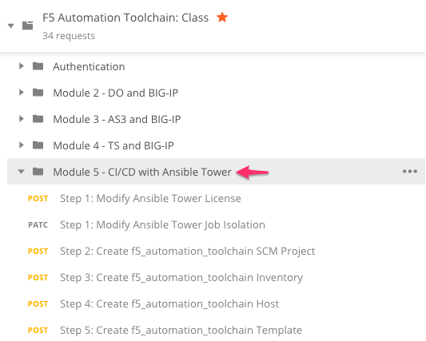
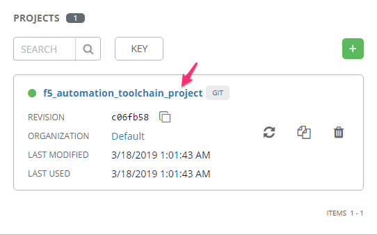
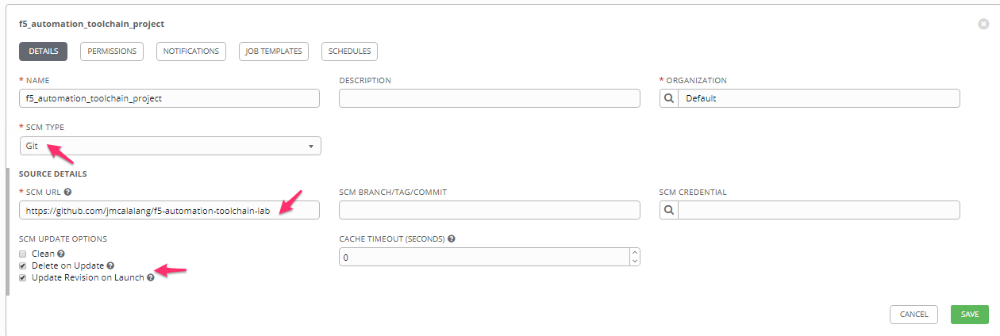
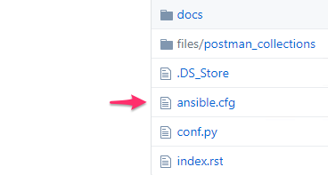
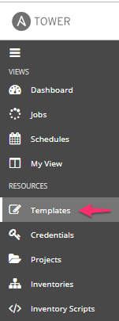
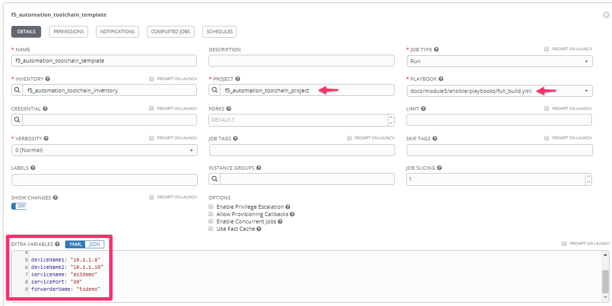
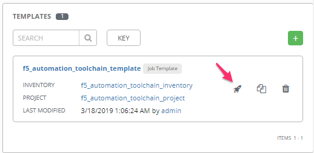
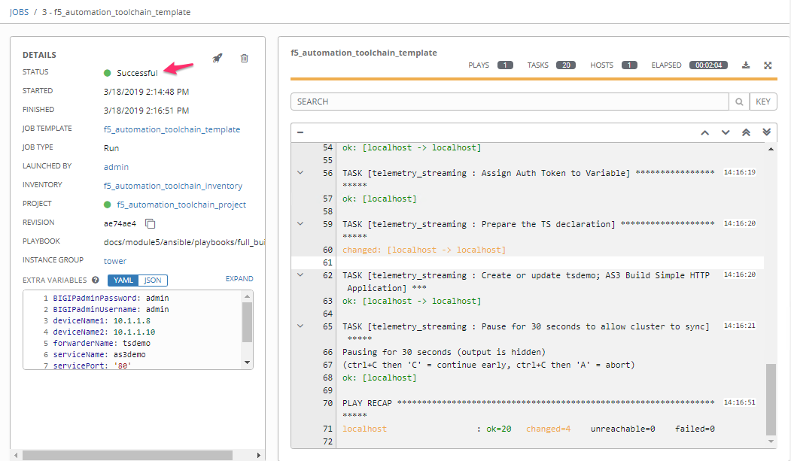
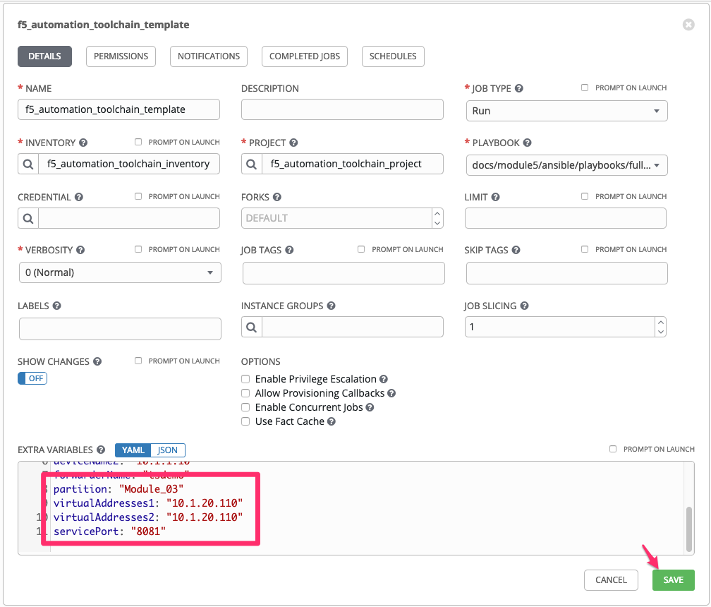

Module |labmodule|\, Lab \ |labnum|\: CI/CD with Ansible Tower
==============================================================

Lab scenario:
~~~~~~~~~~~~~

|image1| Ansible Tower

F5 Declarative Onboarding, Application Services 3, and Telemetry Streaming are solutions that function well within templated environments. The use of single declarative configuration files and idempotent solutions create scenarios where systems with proper testing can progress from Continuous Delivery to Continuous Deployment.

Ansible Tower is being utilized in this lab to show the possibility of an orchestration engine with capabilities for large scale deployments. Tower has many features which will not be covered in this lab; however, two concepts that **are** covered are `Projects` and `Templates`.

Objects highlighted in this module.

 - A Project_ is a logical collection of Ansible playbooks, represented in Tower.
 - A job Template_ is a definition and set of parameters for running an Ansible job.

The entirety of this lab is in Source Control, with different tools using different parts. Postman imported our collection directly from Source Control, the documentation and configuration examples are also pulled from the same source, giving a real example of `Source-of-Truth`. We are now going to integrate Module 5 of this lab into Ansible Tower.

Task |labmodule|\.\ |labnum|\.1
~~~~~~~~~~~~~~~~~~~~~~~~~~~~~~~

.. note:: Ansible Tower is **already** installed and configured, ready to be executed. The Postman Collection for this lab also contains the Ansible Tower configuration located in the `Module 5 - CI/CD with Ansible Tower` selection.

Ansible Tower utilizing Projects connected to an SCM will parse a GitHub repository looking for an `ansible.cfg` file, this file presents logical paths for objects used in the Project.

Using `Chrome` open a tab to Ansible Tower.

- Ansible Tower User: ``admin``
- Ansible Tower Password: ``admin``

  |image3|

Task |labmodule|\.\ |labnum|\.2
~~~~~~~~~~~~~~~~~~~~~~~~~~~~~~~

Updating Ansible Tower from Source Control.

.. note: Ansible Tower version is `Tower 3.4.2` Ansible Version is `Ansible 2.7.9`.

Navigate to `Projects`.

  |image4|

Navigate to the `f5_automation_toolchain_project`.

  |image5|

The project pulls in its configuration from GitHub, and the `SCM URL` is the repository containing all our lab. Other Update settings are used because we create templated objects (jinja2 files), which we want to be cleared out on an update, removing overlapping configuration issues.

  |image6|

The repository for this lab is public, ansible.cfg instructs Ansible Tower where it needs to lookup Ansible specific object (Roles and Playbooks)

  |image7|

Return to the `Projects` Tab. We need to update our Ansible Tower from Source Control, as our source goes through changes we want to make sure whatever we are working with is the most current.

``Update`` from source by clicking on the loop icon. 

  |image8|

This operation triggers an Ansible Tower `Job` to get the current configuration, this is viewed in `Jobs` and tagged as an `SCM Update`.

  |image9|

Navigating into the Job exposes the tasks and console of how the job performed.

  |image10|

Task |labmodule|\.\ |labnum|\.3
~~~~~~~~~~~~~~~~~~~~~~~~~~~~~~~

Execute a pipeline for BIG-IP configuration as code.

Navigate to `Templates`.

  |image11|

Navigate to the `f5_automation_toolchain_template`.

The Template is wrapped around our previously created Project, within the Template is where we organize and define the resources needed to run the Ansible Job.

In this Template we are going to use:

- Our Project imported from SCM `f5_automation_toolchain_project`
- Our Inventory (localhost) as our Ansible target
- A playbook located at `docs/module5/ansible/playbooks/full_build.yml`
- Extra Variables

  |image12|

Extra Variables include:

.. literalinclude :: files/f5_automation_toolchain_template_extra_variables.yml
   :language: yaml

.. Note:: There are other Playbooks in this SCM repository. Specifically, there is one for each of our Automation Toolchain objects and the full_build. The full_build runs all the roles for each of the Automation Toolchain objects together.

Return to the `Templates` Tab. We are going to deploy our Template which stitches together all our objects and runs against our BIG-IPs.

``Deploy`` the Template by clicking the Deploy icon.

  |image13|

The Template deploys all the code we have used previously in modules 2-4. However, because the Automation Toolchain objects are idempotent, no change is enacted on the BIG-IPs. 

  |image14|

Reviewing the Playbook execution we can see some testing and error handling that has been built into the tasks. The BIG-IP(s) are verified to be accessable, and then the endpoints for each of the Automation Toolchain item is verified up and available. This order makes use of good Just-In-Time (JIT) delivery and concepts for automation practices.

.. Note:: At this point, we have progressed into a solution that could be Continuously Delivered. 

Task |labmodule|\.\ |labnum|\.4
~~~~~~~~~~~~~~~~~~~~~~~~~~~~~~~

Mutation of objects and creating reusable items.

Template systems with single configuration files can lead to many **Snow-Flake** configuration items if not thought about early in the process. Without the use of parameters, the solution created in this lab would only be useful for one deployment. To highlight how an AS3 solution could be reused, we are going to change some of the extra variables in our Template creating additional services. 

This lab is currently running 3 different applications. Through this point of the lab, we have been exposing the `F5 Hello World` application; we are now going to use the same template to deploy services to expose the `Hackazon` and `DVWA` applications.

This Table represents the applications and extra variables we will use to create our additional deployments.

+--------------------+-----------+-------------------+-------------------+-------------+
| **serviceName**    | partition | virtualAddresses1 | virtualAddresses2 | servicePort |
+--------------------+-----------+-------------------+-------------------+-------------+
| **Module_03**      | Module_03 | 10.1.10.110       | 10.1.10.111       | 8081        |
+--------------------+-----------+-------------------+-------------------+-------------+
| **Hackazon**       | Hackazon  | 10.1.10.112       | 10.1.10.113       | 80          |
+--------------------+-----------+-------------------+-------------------+-------------+
| **DVWA**           | DVWA      | 10.1.10.114       | 10.1.10.115       | 8082        |
+--------------------+-----------+-------------------+-------------------+-------------+

Return to the `f5_automation_toolchain_template` in Ansible Tower.

Located at the bottom of the template are the extra variables, **manipulate the extra variables** with the values from the table above to deploy one of our additional applications.

  |image15|

.. note:: The template is defaulted to run the **full_build.yml** playbook, if you want to save time you can set this to the **application_services_3.yml**.

Save the Template with your new variables and playbook defined, then rerun the template.

  |image13|

Return to one of the BIG-IPs and see the culmination of all the services deployed.

  |image16|

This concludes Module 5 and utilizing Ansible Tower for Templates and Jobs to create reusable items.

.. |labmodule| replace:: 5
.. |labnum| replace:: 1
.. |labdot| replace:: |labmodule|\ .\ |labnum|
.. |labund| replace:: |labmodule|\ _\ |labnum|
.. |labname| replace:: Lab\ |labdot|
.. |labnameund| replace:: Lab\ |labund|

.. |image1| image:: images/image1.png
   :width: 200px

.. |image3| image:: images/image3.png
   :width: 70%
.. |image4| image:: images/image4.png

.. |image8| image:: images/image8.png
.. |image9| image:: images/image9.png
.. |image10| image:: images/image10.png

.. |image16| image:: images/image16.png
   :width: 50%

.. _Project: https://docs.ansible.com/ansible-tower/latest/html/userguide/projects.html
.. _Template: https://docs.ansible.com/ansible-tower/latest/html/userguide/job_templates.html
