Module |labmodule|\, Lab \ |labnum|\: Kafka Service for Telemetry Streaming
===========================================================================

Lab scenario:
~~~~~~~~~~~~~

|image1| Apache Kafka

Telemetry Streaming was used in two parts of this lab, though it appears as a single. Within the AS3 declaration, we made the first parts of Telemetry Streaming; this included the High-Speed Logging (HSL_) pool containing our destinations of the management addresses of our BIG-IP cluster. The AS3 declaration also contained the pieces needed to build our Request Logging Profile, which included info we would like to gather from clients connecting to our VIP, which had the newly created profile.

During Telemetry Streaming lab we created TS objects; one of them was the listener we defined in the AS3 declaration, another other was the poller that reached back into the BIG-IP looking for statistical information. The last object needed in the mix was our forwarder, which would send the polled data, and our request logging data to our defined consumer, in this deployment is a Kafka topic with the name `f5-telemetry`.

.. warning:: This lab does require command line manipulation if you need help ask an instructor.

Task |labmodule|\.\ |labnum|\.1
~~~~~~~~~~~~~~~~~~~~~~~~~~~~~~~

From your lab portal locate the `Ubuntu 18.04 Lamp Server, RDP, Radius, Docker` server.

Connect to the Ubuntu server through its ``Console`` access

Username: ``f5 student``
Password: ``purple123``

  |image3|

Once logged into the system open up the ``Terminal Emulator``

  |image4|

Run ``ls`` as a command to see the contents of our user home directory. 

  |image5|

We are going to use a container that was created by wurstmeister_ which contains the needed parts for running Kafka in a container; this is Kafka the service as well as zookeeper. 

.. note:: The repository for this container has already been downloaded to the `kafka-docker` folder.

Navigate into the `kafka-docker` folder with the command:

``cd kafka-docker/``

  |image6|

The `docker-compose.yml` file has already been configured with what we need to make the system run correctly, however, you can verify its content with ``cat docker-compose.yml``. This file tells the Kafka system to listen on IP address `10.1.1.5` which is an interface on this virtual machine that the BIG-IPs have access too. 

.. note:: A copy of this file also exists in the source control of this lab under this module /files.

We need to start our Kafka service with docker compose; this command launchs the needed containers and places the service in the background.

``sudo docker-compose up -d``

Started:
  |image7|
  
Complete:
  |image8|

After our containers are started running Kafka, we need to see the external port that Docker assigned while creating and exposing this service.

``sudo docker ps -a``

This command lists all the running containers on this system, a few of them should look familiar we used them in our AS3 template declarations showing new applications in Module 4.

.. warning:: Docker binds this port arbitrarily so that it may be different within your lab.

We are looking for the exposed port matching our `9092` standard Kafka port. Once you locate yours remember it, we **need** it throughout the rest of this lab.

  |image10|

Task |labmodule|\.\ |labnum|\.2
~~~~~~~~~~~~~~~~~~~~~~~~~~~~~~~

.. warning:: Your exposed container port may be different than the lab example (32768), make sure you exchange the lab example for the value of yours.

Once the service is running, we need to jump into a Kafka shell to allow us to interact with Kafka itself. We are going to connect to Kafka and zookeeper.

``sudo ./start-kafka-shell.sh 10.1.1.5 10.1.1.5:2181``

  |image9|

Our console is now in another container that can interact with our running service. We are going to use a Kafka Producer to make sure the service is working correctly; then we can view the Consumer data.

``kafka-console-producer.sh --broker-list 10.1.1.5:32768 --topic f5-telemetry`` 

After this command executes it places you in the producer, you can place some random text in here or as an example:

``this is a test of the kafka system its listening on 32768``

Once you have placed some text exit the shell with ``ctrl+c``.

  |image11|

At this point our Kafka service should be up and have some data on our topic, we are now going to launch our topic and leave it for the rest of the lab.

``kafka-console-consumer.sh --bootstrap-server 10.1.1.5:32768 --topic f5-telemetry --from-beginning``

The command we are running holds open a stream to the topic looking for data that is coming into the system, like our Request log information and our Polling information. All of this is defined in our Telemetry Streaming declaration.

Task |labmodule|\.\ |labnum|\.3
~~~~~~~~~~~~~~~~~~~~~~~~~~~~~~~

During Module 4 we used the standard port for a Kafka service `9092`, this, however, is not the correct port for our recently deployed Kafka service, so we need to update our extra variables in our Ansible Tower Template `f5_automation_toolchain_template`. 

Set your extra variable back to default with this configuration. Copy and paste the below into the extra variables.

.. literalinclude :: ../module5/files/f5_automation_toolchain_template_extra_variables.yml
   :language: yaml

The default value of `9092` for extra variable `consumerPort` needs to be replaced with your service exposed port.

  |image13| 

.. note:: If you changed the template's playbook to **application_services_3.yml** in Module 5, you will need to change the playbook to **full_build.yml** or better yet to **telemetry_streaming.yml** if you want to save execution time.

After your variable is changed save your configuration.

  |image14|

`Deploy` the new changes into the environment. This changes the Telemetry consumer to have the correct destination.

  |image15|

Our configuration is set to be on the HTTPS application of Module3; this is the bookmark in Chrome for `Service_HTTPS`. Browse to the site a few times to generate some traffic.

  |image16|

Return to your console for `Ubuntu 18.04 Lamp Server, RDP, Radius, Docker` and look for streaming data.

.. note:: Polling data is set in our TS declaration to 60 seconds, so data may take a few moments to populate

Data should be slowly streaming into your Kafka environment. From this topic, you could use other systems to parse this data for graphs, analytics, and telemetry.

.. literalinclude :: files/ts_example_output.json
   :language: json

.. |labmodule| replace:: 6
.. |labnum| replace:: 1
.. |labdot| replace:: |labmodule|\ .\ |labnum|
.. |labund| replace:: |labmodule|\ _\ |labnum|
.. |labname| replace:: Lab\ |labdot|
.. |labnameund| replace:: Lab\ |labund|

.. |image1| image:: images/image1.png
   :width: 200px
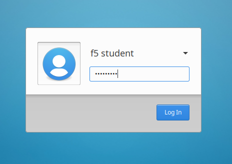
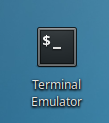
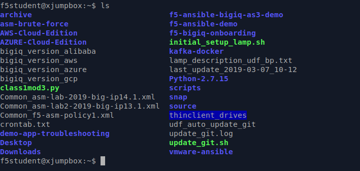
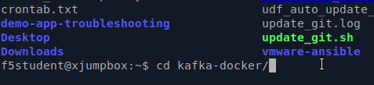
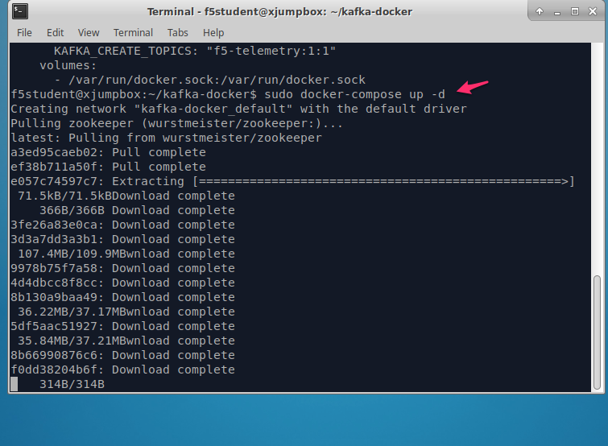
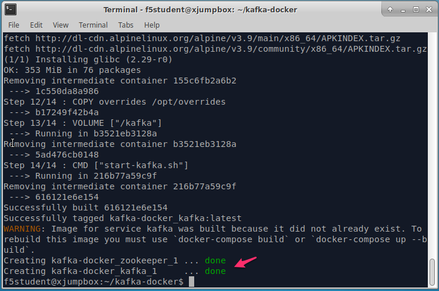
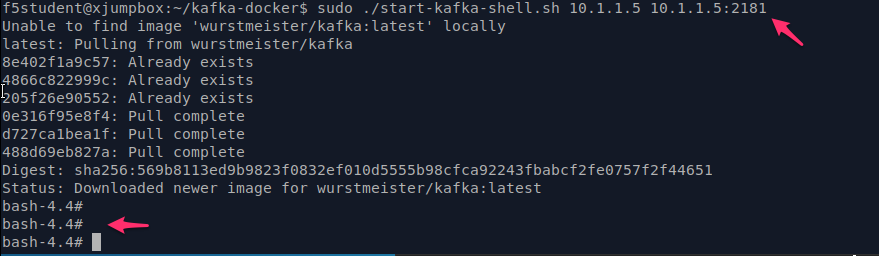
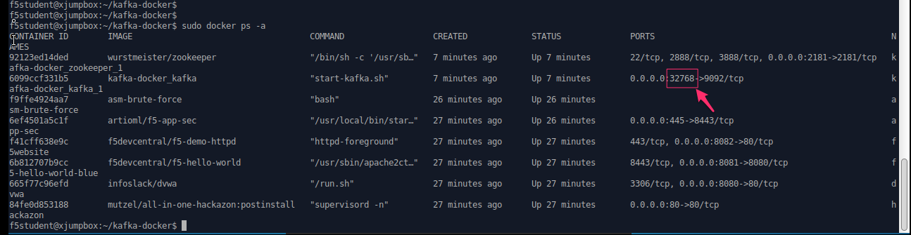
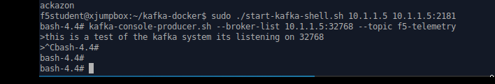
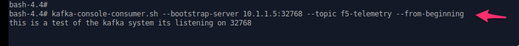
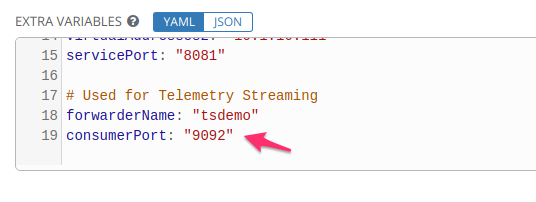
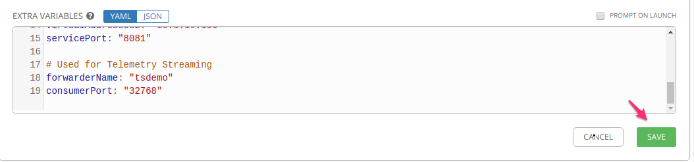
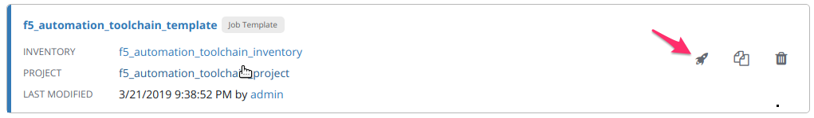

.. _HSL: https://support.f5.com/kb/en-us/products/big-ip_ltm/manuals/product/bigip-external-monitoring-implementations-13-1-0/3.html
.. _wurstmeister : https://github.com/wurstmeister/kafka-docker 
